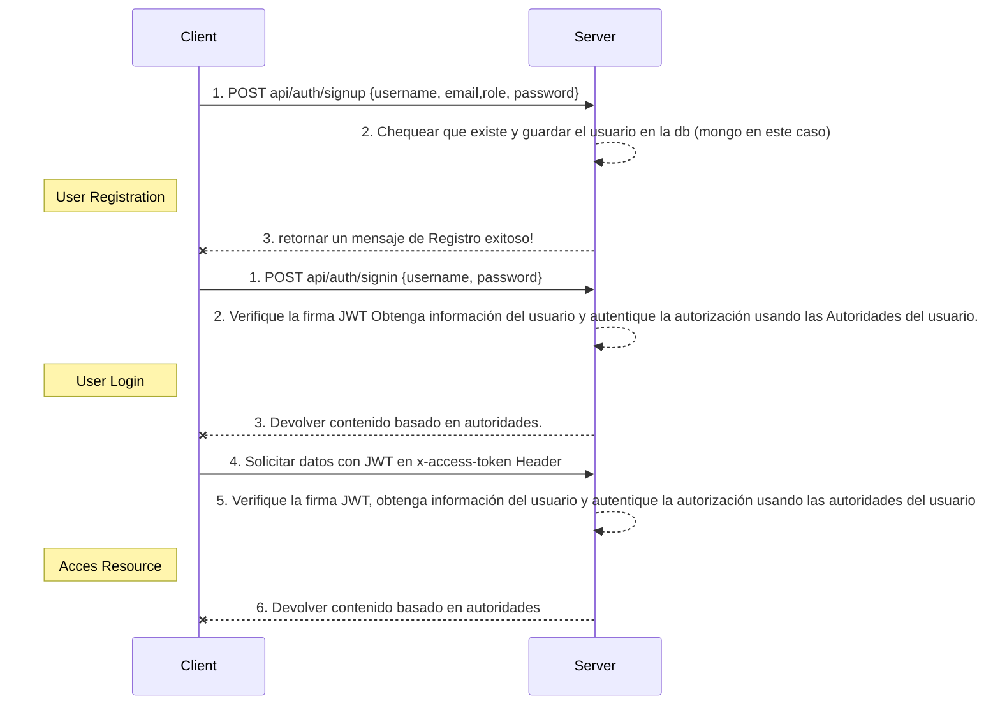

# Backend

## Estructura del proyecto

### Config

En esta carpeta se configuran las variables de entorno que se manejaran con la librería "dotenv". En la misma encontraremos la siguientes variables de entorno:

1. let config: Dónde se definen las variables de entorno de configuración para los puertos, el protocolo de CORS y las variables de entorno para manejar los ambientes de producción y staging.
   > port: process.env.PORT,
   > cors: process.env.CORS,
   > dev: process.env.NODE_ENV !== "production",
2. let mongo_db: Dónde se definen las variables para el manejo de la base de datos, en este caso no relacional. Se utilizará mongo y como gestor de la base, se trabajá con Mongo Atlas, el servicio en la nube de Mongo.

   > uri: process.env.MONGO_DB_URI,
   > name: process.env.DB_NAME,
   > mongo_atlas: process.env.MONGO_ATLAS,

3. let email: En esta parte se configuran las variables para el manejo del mail que se envía cuando se loguea alguien por primera vez y cuando se termina una compra. Se trabaja con la librería de Twilio para el manejo de esta parte
   > userEmail: process.env.USER_EMAIL,
   > passwordEmail: process.env.PASSWORD_EMAIL,

## Arquitectura

Se trabaja con la arquitectura de clean code, ordenando las carpetas en capas. En el siguiente proyecto se trabaja con el modelo controllers > services > daos > models. A continuación detallará la estructura que hay dentro de cada uno de estos modelos:

### Controllers

Manejan los endpoint de la API para gestionar los servicios del Ecommerce. Para este funcionamiento se establecieron las siguientes carpetas:

1. ControllerProductos.js : Contiene todos los endpoint para el manejo de los productos. Para los requisitos de este producto se manejan los siguientes endpoint:

   > - get(api/productos): En este podemos encontrar todos los productos del ecommerce.
   > - get(api/productos/:id): En este caso buscaremos traer sólo un producto por el id seleccionado.
   > - post(api/productos): En este endpoint se podrán cargar nuevos productos.
   > - put(api/productos/:id): Con esta ruta se podrá actualizar un porducto en específico por id.
   >   delete(api/productos/:id): Para eliminar un producto en particular.

2. ControllerCarrito.js: Contiene los endpoint que se utilizan para el manejo del carrito. Para los requisitos de este, se manejan los siguientes endpoint:
   > - get(api/carrito): Permite traer todos los productos de los carritos.
   > - get(api/carrito/:id): Permite traer los productos de un carrito en particular identificado por su id.
   > - post(api/carrito): Permite cargar nuevos carritos.
   > - put(api/carrrito/add/:id): Permite agregar productos a un carritos determinado por id.
   > - put(api/carrito/remove/:id): Permite remove productos de un carrito en especifico identificado por id.
   > - delete(api/carrito/:id): Permite eliminar un carrito en función de su id.
3. ControllerUsuario.js: Este controller permite manejar todo lo relacionado con los usuarios, como login y registro para los roles de admin y su respectivo logout. En este controller tenemos las siguientes características:
   > - post(api/usuario/register): Este endpoint permite manejar la API para cargar el registro de nuevos usuarios.
   > - post(api/usuario/signIn): Este endpoint permite manejar la API para el logueo de los usuarios.

### Services

En está parte se va a poder encontrar los sevicios necesarios para manejar los controllers antes mencionados, dentro de esta parte cabe destacar lo siguiente:

1. Para el registro y login se trabajara con la lógica de JWT. En base a esto, la lógica se armará de la siguiente manera:
   a. Es un token de seguridad que nosotros creamos al momento que el usuario se registra con sus credenciales.
   b. Este token se devuelve al cliente el cual tendrá que enviar cada vez que solicita información al servidor.
   c. Se divide en 3 partes: Header, Payload y Verify Signature:
   Revisar: https://jwt.io/

2. Se trabaja con la librería md5 para hacer el hasheo del registro del usuario:
   Revisar: https://www.npmjs.com/package/md5

## Flujo para registro de usuario e inicio de sesión de usuario



### Daos

En los Daos se puede encontrar la capa intermedia para acceder a la base de datos. Se cuenta en esta carpeta tres daos para manejar cada uno de los servicios: productos, carrito y usuarios. En las mismas creamos las siguientes funciones para su correcto manejo:
Generales a todos los Componentes:

> - getAll(): Para traer todos los datos.

1. ProductoDao.js:
   > - getById(Id): Para traer un producto por id.
   > - create(entityToCreate): Para crear un nuevo porducto con los datos recididos
   > - update(id, entityToUpdate): Para actualizar un producto por id, con los datos a actualizar que se pasan por parámetro.
   > - delete(id): Para eliminar un producto por id.
2. CarritoDao.js:
   > - getById(Id): Para traer un carrito por el id especificado.
   > - create(entityToCreate): Para crear un nuevo carrito con los datos correspondientes, recibidos por parámetros.
   > - update(id, entityToUpdate): Para actualizar un carrito por id, con los datos a actualizar que se pasan por parámetro.
   > - delete(id): Para eliminar un carrito por id.
3. UsuarioDao.js:
   > - getUser(email): Para obtener un usuario con el mail recibido por parámetro.
   > - create(email, password, firsname, lastname): Para crear un nuevo usuario con los datos recibidos por parámetro. Método utilizado para el registro.
   > - getUserByEmailAndPassword(email, password): para obtener un usuario por email y password. Método utilizado para el login.

### Models

En esta parte se podrá encontrar los schemas definidos para la creación de los diferentes modelos que se manejarán, en este caso se trabajarán con los siguientes modelos:

1. ModelProeducto

```
const  productosSchema  =  mongoose.Schema({
	timestamp:  String,
	nombre:  String,
	precio:  String,
	descripcion:  String,
	codigo:  String,
	foto:  String,
	stock:  String,
	id:  String
})
```

2. ModelCarrito

```
const  carritoSchema  =  mongoose.Schema({
	timeStamp:  String,
	productos:  [Object],
	id:  String
})
```

3.ModelUsuario

```
const  usuarioSchema  =  mongoose.Schema({
	lastName:  { type:  String  },
	firstName:  { type:  String  },
	email:  { type:  String, unique:  true, lowercase:  true  },
	password:  { type:  String  },
	signUpDate:  { type:  Date, default:  Date.now()  },
	lastLogin:  Date,
})
```

### Exceptions

Es carpeta contiene una clase para manejar las excepciones que se utilizan a los largo de todo el proyecto para el manejo de los status cuando se consulta a la API y se obtienen diferentes status. Los definidos prinicpalmente son los status 200, 201, 400, 404 y 500. De está manera se puede encontrar mayor información en caso de que el sistema falle o no pueda acceder a la API.

### Public

En esta parte del proyecto es el lugar donde se encuentran todas los contenidos públicos del mismo, para este caso, se utiliza para dejar todas las imágenes relacionadas con los productos a cargar en el ecommerce y las imagenes que se envía por mail cuando el usuario se registra por primera vez y cuando debe confirmar la compra del carrito.

### Utils

En esta carpeta se guardar todas los componentes transversales a todo el proyecto, todos aquellos elementos que se puede requerir y utilizar en cualquier parte del mismo. En nuestro caso se definieron los siguientes elementos:

1. loggers: Haciendo uso de la librería de winston, se configuraron los logs para mostrar, separando cuando se trata de un ambiente de producción y uno de staging, para poder visualizar los logs, sin la necesidad de utilizar los console.log que detienen la aplicación en su ejecución y adempás permitiendo obtener información en caso de la aparición de algún error en el proyecto, poder tener información para resolverlo.
2. performance: Haciendo uso del modo cluster y con la utilización de la librería de Artillery, se creo una función para poder evaluar los diferentes endpoint que aparecen en el proyecto.
3. helpers: En esta carpeta se encuentran las funciones de ayuda. Tenemos definidos las siguientes funciones para este apartado:
   1. Una función que se utiliza para enviar el mail, mediante la librería de Twilio. Esta funcionalidad esta desarrollada en esta utilidad y se utiliza cuando el usuario se registra por primera vez y cuando termina su compra en el carrito.
4. Firebase: Hay una carpeta de utiliadad extra para Firebase, en caso de necesitar switchear con otra base de datos de facil comunicación. Se tiene definido la configuración y la conexión a firebase sobretodo con el objetivo de probar el login y registro en caso de ser necesario.

### Servidor

En este módulo, colocado a la altura de la App.js, se encuentra la lógica para manejar el chat.
El chat esta compuesto por un usuario administrador y por usuarios clientes los cuáles escribirán al admin para comunicarse con este en caso de necesitarlo.
El chat del admin podrá recibir los char de los clientes, tantos cómo sean necesarios, pudiendo responder de manera separada a cada una de sus consultas realizadas.

### DockerFile

Se realiza la configuración de un DockerFile, para poder crear el ambiente y que se de mayor facilidad poder subir el proyecto en Heroku.

### Procfile

Es archivo de heroku permite configurar las variables y todo lo necesario para subir el proyecto.
Para este caso, se realizó toda la configuración en la nube, pero como próximo release se pasará la lógica a este archivo.

### .env y .env.prod

Son los archivos donde se definen las variables de entorno, una para el ambiente de producción y otra para el ambiente de staging.

## Librerías

### dependencias

    * artillery
    * bcrypt
    * cors
    * dotenv
    * express
    * firebase
    * jsonwebtoken
    * md5
    * mongodb
    * mongoose
    * nodemailer
    * socket.io
    * twilio
    * winston

### dependencias de desarrollo

    * nodemon

## ¿Qué tengo que tener instalado para correr el proyecto?

```
- `node js versión 14 o superior`
- `npm versión 7 o superior`
```

## Cómo correr el Proyecto desde 0

### Forma 1:

Posicionado en la carpeta raíz se ejecutará el siguiente comando:

- `cd backend`
  dentro de la carpeta backend se deberá instalar la carpeta de node modolues de node mediante el siguiente comando:
  `- `npm ci
  Una vez instalado el node_modules, tendremos dos partes del proyecto backend para correr, que son: 1. La API para consumir desde el front, para lo cual corremos el siguiente comando:
  `npm run dev` 2. El server para correr el chat, para lo cuál tenemos que estar posicionados dentro de la carpeta "raíz del proyecto"/backend y ejecutar el siguiente comando:
  `node servidor.js`
  De esta manera ya tenemos corriendo los dos desarrollos del lado de Backend para nuestra aplicación.

### Forma 2:

Para el caso de nuestro API

run-back:
npm run --prefix ./backend dev
Revisar

## Infraestructura

Se realizó la infraestructura en Heroku. Colocando las variables de entorno en el servidor en la nube.

## Repositorio del Proyecto

https://github.com/srisposi/Proyecto-Final

## Demo de la Aplicación

https://ecommerce-aura.herokuapp.com/

## Endpoint

### CRUD de Producto

### Obtener producto

`GET`
**Endpoint**

```
getById
http://localhost:8007/api/productos/BwM8eBKBAOHZUWZS7MZt
```

`GET`
**Endpoint**

```
getAll
http://localhost:8007/api/productos
```

### Cargar producto

`POST`
**Endpoint**

```
http://localhost:8007/api/productos
```

**Header**

```
{
	"Content-Type":"application/json",
	"auth":"77dGVzdCs0QGdtYWlsLmNvbTpZMjl1ZEhKaGMyWERzV0U9",
}
```

**Body**

```json
{
  "timestamp": "",
  "nombre": "lapicera Ejemplo",
  "precio": 12,
  "descripcion": "La lapicera es un producto muy noble",
  "codigo": "0001",
  "foto": "",
  "stock": 5
}
```

### Modificación de Producto

`PUT`
**Endpoint**

```
updateById
http://localhost:8007/api/productos/Bvrtsasw
```

**Header**

```
{
	"Content-Type":"application/json",
}
```

**Body**

```json
{
  "timestamp": "",
  "nombre": "lapicera Ejemplo",
  "precio": 12,
  "descripcion": "Ya no sería un producto tan noble",
  "codigo": "0001",
  "foto": "",
  "stock": 5
}
```

### Eliminar Producto

`DELETE`
**Endpoint**

```
deleteById
http://localhost:8007/api/productos/4
```

**Body**

```json
{
  "timestamp": "",
  "nombre": "lapicera Ejemplo",
  "precio": 12,
  "descripcion": "La lapicera es un producto muy noble",
  "codigo": "0001",
  "foto": "",
  "stock": 5
}
```

### CRUD de Carrito

### Obtener Carrito

`GET`
**Endpoint**

```
getAll
http://localhost:8007/api/carritos/
```

`GET`
**Endpoint**

```
getById
http://localhost:8007/api/carritos/5eb7ed9e-47c9-4be0-95e1-11da5b89cf00
```

### Carga Carrito

`POST`
**Endpoint**

```
http://localhost:8007/api/carritos
```

### Modificación de Carrito

`PUT`
**Endpoint**

```
updateById
http://localhost:8007/api/carritos/add/5eb7ed9e-47c9-4be0-95e1-11da5b89cf00
```

**Header**

```
{
	"Content-Type":"application/json",
}
```

**Body**

```json
{
  "idProducto": "624503408eb14488cf744d94"
}
```

### Baja de Carrito

`DELETE`
**Endpoint**

```
deleteById
http://localhost:8007/api/carritos/f14ad5da-b5d5-4364-811d-0acfda7ea018
```

### CRUD de Usuario

### SignIn

`POST`
**Endpoint**

```
http://localhost:8007/api/usuario/signIn
```

**Header**

```
{
	"Content-Type":"application/json",
}
```

**Body**

```json
{
  "email": "test+7@gmail.com",
  "password": "contraseña"
}
```

### SignUp

`POST`
**Endpoint**

```
http://localhost:8007/api/usuario/register
```

**Header**

```
{
	"Content-Type":"application/json",
}
```

**Body**

```json
{
  "lastName": "apellido",
  "firstName": "nombre",
  "email": "test+19@gmail.com",
  "password": "contraseña"
}
```
